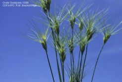

---

+ [Paper](/pdfs/Villaretal-1998-NewPhytolHQ.pdf)

---

##### Citation

Villar, R., Veneklaas, E.J., Jordano, P., Lambers, H. 1998. Relative growth rate and biomass allocation in 20 Aegilops species. New Phytologist 140: 425-437.

---

##### Notes

 36. Jordano, P. and C. M. Herrera. 1995. Shuffling the offspring: uncoupling and spatial discordance of multiple stages in vertebrate seed dispersal. Écoscience 2: 230-237.

---

##### Figure

