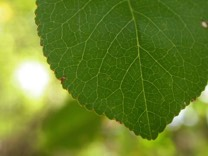

---

+ [Paper](/pdfs/JordGod2000MolEcol.pdf)

---

##### Citation

Jordano, P. and J.A. Godoy. 2000. RAPD variation and population genetic structure of *Prunus mahaleb*, an animal-dispersed tree. Molecular Ecology. 9: 1293-1305.

---

##### Notes

 38. Herrera, C.M., Jordano, P., Guitián, J. y Traveset, A. 1998. Annual variability in seed production by woody plants and the masting concept: reassessment of principles and relationship to pollination and seed dispersal. American Naturalist 152: 576-594.

---

##### Figure

