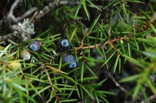

---

+ Paper

---

##### Citation

García, D., R. Zamora, J.M. Gómez, P. Jordano and J.A. Hódar. 2000. Geographical variation in seed viability in *Juniperus communis* throughout the Palaearctic: distribution and operational reproductive limits in Mediterranean high-mountains. Journal of Ecology 88: 435-446.

---

##### Figure

