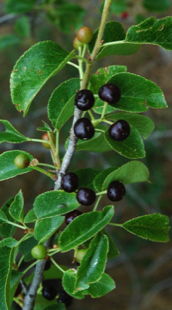

---

+ [Paper](/pdfs/Jordano&Schupp_2000_EcolMonogr_Prunus.pdf)

---

##### Citation

Jordano, P. and E. W. Schupp. 2000. Determinants of seed disperser effectiveness: the quantity component and patterns of seed rain for *Prunus mahaleb*. Ecological Monographs 70: 591-615.

---

##### Figure

