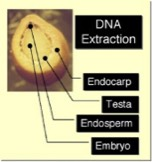

---

+ [Paper](/pdfs/Godoy&Jordano_2001_MolEcol.pdf)

---

##### Citation

Godoy, J.A. and P. Jordano. 2001. Seed dispersal by animals: exact tracking of the source trees with endocarp DNA microsatellites. Molecular Ecology 10: 2275-2283.

---

##### Notes

 43. Jordano, P. 2001. Conectando la ecología de la reproducción con el reclutamiento poblacional de especies leñosas Mediterráneas. In: Zamora, R. and F. Pugnaire (eds.). Aspectos funcionales de los ecosistemas Mediterráneos. Consejo Superior de Investigaciones Científicas, Madrid Pages: 183-211.

1995/2000

---

##### Figure

