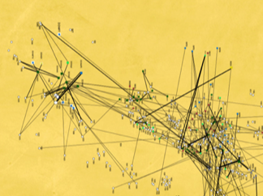

---

+ [Paper](/pdfs/Jordano&Godoy_2002_Ch20-Frugivore_seed_shadows-FSD.pdf)

---

##### Citation

Jordano, P. and J.A. Godoy. 2002. Frugivore-generated seed shadows: a landscape view of demographic and genetic effects. Pages 305-321 in: Levey, D.J., Silva, W.R. and M. Galetti (eds.). Seed dispersal and frugivory: ecology, evolution and conservation. CAB International International, Wallingford, UK.

---

##### Notes

 46. Jordano, P., R. Zamora, T. Marañón and J. Arroyo. 2002. Claves ecológicas para la restauración del bosque mediterráneo. Aspectos demográficos, ecofisiológicos y genéticos. [Ecosistemas 11](/pdfs/ecosistemas__ecosistemas.html).

45. Jordano, P., R. Zamora, T. Marañón and J. Arroyo. 2001. Ecological and demographic research in Mediterranean forests of Southern Spain: applications to conservation and restoration. Pages 377-381 in: Radoglou, K. (ed.). Proc. Int. Conf. on Forest Research: A challenge for an integrated European approach. NAGREF, Forest Research Institute, Thessaloniki, Greece.

---

##### Figure

