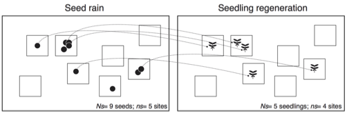

---

+ [Paper](/pdfs/Jordano_etal_2004_Bosque_Mediterraneo_cap8.pdf)

---

##### Citation

Jordano, P., Pulido, F., Arroyo, J., García-Castaño, J.L. y García-Fayos, P. 2004. Procesos de limitación demográfica. En: Valladares, F. (ed.). Ecología del bosque mediterráneo en un mundo cambiante. Págs. 229-248. Ministerio de Medio Ambiente, EGRAF, S.A., Madrid. ISBN: 84-8014-552-8. A pdf version of this book can be found in the [GLOBIMED site](http://www.globimed.net/publicaciones/LibroEcoIndice.htm).

---

##### Notes

 53. Arroyo, J., Carrión, J.S., Hampe, A. y Jordano, P. 2004. La distribución de especies a diferentes escalas espacio-temporales. En: Valladares, F. (ed.). Ecología del bosque mediterráneo en un mundo cambiante. Págs. 27-67. Ministerio de Medio Ambiente, EGRAF, S.A., Madrid. ISBN: 84-8014-552-8. A pdf version of this book can be found in the [GLOBIMED site](http://www.globimed.net/publicaciones/LibroEcoIndice.htm).

 52. Marañón, T., Camarero, J.J., Castro, J., Díaz, M., Espelta, J.M., Hampe, A., Jordano, P., Valladares, F., Verdú, M. y Zamora, R. 2004. Heterogeneidad ambiental y nichos de regeneración. En: Valladares, F. (ed.). Ecología del bosque mediterráneo en un mundo cambiante. Págs. 69-99. Ministerio de Medio Ambiente, EGRAF, S.A., Madrid. ISBN: 84-8014-552-8. A pdf version of this book can be found in the [GLOBIMED site](http://www.globimed.net/publicaciones/LibroEcoIndice.htm).

2001/2003

 51. Hampe, A., J. Arroyo, P. Jordano, and R.J. Petit. 2003. Rangewide phylogeography of a bird-dispersed Eurasian shrub: contrasting Mediterranean and temperate glacial refugia. Molecular Ecology 12: 3415-3426.

---

##### Figure

