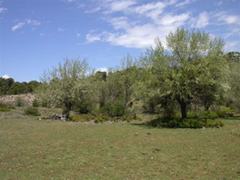

---

+ [Paper](/pdfs/Garcia_etal_2005_MolEcol_Pollen_dispersal_patterns.pdf)

---

##### Citation

García, C., Arroyo, J.M., Godoy, J.A. and P. Jordano. 2005. Mating patterns, pollen dispersal, and the ecological maternal neighbourhood in a *Prunus mahaleb* L. population. Molecular Ecology 14: 1821-1830.

---

##### Notes

 55. Guimarães Jr., P.R., de Aguiar, M.A.M., Bascompte, J., Jordano, P., and Furtado dos Reis, S. 2005. Random initial condition in small Barabasi-Albert networks and deviations from the scale-free behavior. Physical Review E, 71: 037101.

---

##### Figure

