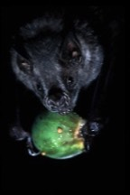

---

+ [Paper](/pdfs/Mello_etal_2005_ActaChiropt.pdf)

---

##### Citation

Mello, M.A.R., Leiner, N.O., Guimarães Jr, P.R., Jordano, P. 2005. Size-based fruit selection of *Calophyllum brasiliense* (Clusiaceae) by bats of the genus *Artibeus* (Phyllostomidae) in a Restinga area, southeastern Brazil. Acta Chiropterologica, 7: 179-182.

---

##### Figure

