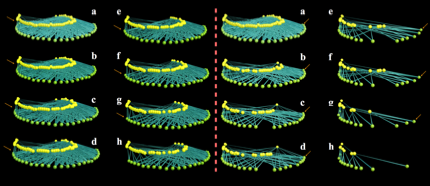

---

+ [Paper](/pdfs/Jordano_etal_2006_UCP_book_Pollination_networks.pdf)

---

##### Citation

Jordano, P., Bascompte, J. and Olesen, J.M. 2006. The ecological consequences of complex topology and nested structure in pollination webs. In: Waser, N.M. and J. Ollerton (eds.). Specialization and generalization in plant-pollinator interactions. University of Chicago Press, EEUU. Pages: 173-199.

---

##### Notes

2004/2005

---

##### Figure

