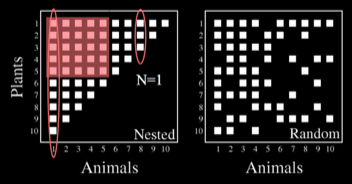

---

+ [Paper](/pdfs/Lewinsohn_etal_2006_Oikos.pdf)

---

##### Citation

Lewinsohn, T. M., Prado, P., Jordano, P., Bascompte, J. & Olesen, J. M. 2006. Structure in plant-animal interaction assemblages. Oikos113: 174-184.

---

##### Figure

