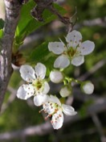

---

+ [Paper](/pdfs/Garcia_etal_2007_MolEcol_Pollen_and_seed_dispersal_in_Prunus_mahaleb.pdf)

---

##### Citation

García, C., P. Jordano and J.A. Godoy. 2007. Contemporary pollen and seed dispersal in a *Prunus mahaleb* population: patterns in distance and direction. Molecular Ecology, 16: 1947-1955.

---

##### Notes

 71. Sagnard, F., C. Pichot, P. Dreyfus, P. Jordano, and B. Fady. 2007. Modelling seed dispersal to predict seedling recruitment: recolonization dynamics in a plantation forest. Ecological Modelling, 203: 464-474.

 70. Duminil, J., Fineschi, S., Hampe, A., Jordano, P., Salvini, D., Vendramin, G.G., and Petit, R.J. 2007. Can plant population genetic structure be predicted from life history traits? American Naturalist 169: 662-672.

---

##### Figure

