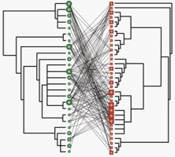

---

+ [Paper](/pdfs/Rezende_etal_2007_Nature.pdf)

---

##### Citation

Rezende, E., Lavabre, J., Guimarães Jr., P.R., Jordano, P. and Bascompte, J. 2007. Non-random coextinctions in phylogenetically structured mutualistic networks. Nature 448: 925-928. Supplementary material is here: and [here](/pdfs/Rezende_etal_2007_Nature_S2.xls) (.xls file). The accompanying comment in 'News and Views' section is [here](/pdfs/Renner_2007_Nature_News&Views.pdf).

---

##### Figure

