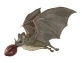

---

+ [Paper](/pdfs/Jordano_2007_Ch10-CABI_Frugivores,_seeds,_genes_FSD.pdf)

---

##### Citation

Jordano, P. 2007. Frugivores, seeds and genes: analysing the key elements of seed shadows. Pages 229-251 in: Dennis, A., Green, R., Schupp, E.W., and Wescott, D. (eds.). Frugivory and seed dispersal: theory and applications in a changing world. Commonwealth Agricultural Bureau International, Wallingford, UK.

---

##### Notes

A sample of chapter (including the book table of contents) is [here](http://www.cabi.org/pdf/books/9781845931650/9781845931650.pdf).

---

##### Figure

