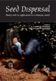

---

+ [Paper](/pdfs/Godinez&Jordano_2007_Ch17-FSD.pdf)

---

##### Citation

Godínez, H. and Jordano, P. 2007. Seed dispersal by frugivores: An empirical approach to analyze their demographic consequences. Pages 391-406 in: Dennis, A., Green, R., Schupp, E.W., and Wescott, D. (eds.). Frugivory and seed dispersal: theory and applications in a changing world. Commonwealth Agricultural Bureau International, Wallingford, UK.

---

##### Notes

A sample of chapter (including the book table of contents) is [here](http://www.cabi.org/pdf/books/9781845931650/9781845931650.pdf).

---

##### Figure

