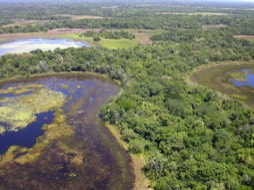

---

+ [Paper](/pdfs/Donatti_etal_2007_05Seed_Dispersal-FSD.pdf)

---

##### Citation

Donatti, C.I., Galetti, M., Pizo, M.A., Guimarães Jr., P.R., and Jordano, P. 2007. Living in the land of ghosts: Fruit traits and the importance of large mammals as seed dispersers in the Pantanal, Brazil. Pages 104-123 in: Dennis, A., Green, R., Schupp, E.W., and Wescott, D. (eds.). Frugivory and seed dispersal: theory and applications in a changing world. Commonwealth Agricultural Bureau International, Wallingford, UK.

---

##### Notes

A sample of chapter (including the book table of contents) is [here](http://www.cabi.org/pdf/books/9781845931650/9781845931650.pdf).

---

##### Figure

