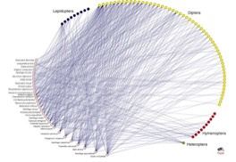

---

+ [Paper](/pdfs/Bascompte&Jordano_2008_InvCiencia.pdf)

---

##### Citation

Bascompte, J. y Jordano, P. 2008. Redes mutualistas de especies. Investigación y Ciencia. September issue.

---

##### Notes

 85. Carnicer, J., Abrams, P., and Jordano, P. 2008. Switching behavior, coexistence and diversification: contrasting empirical community-wide evidence with theoretical predictions. Ecology Letters 11: 802-808.

 84. Hampe, A., García-Castaño, J.L., Schupp, E.W., and Jordano, P. 2008. Initial recruitment of vertebrate-dispersed woody plants: a spatially explicit analysis across years. Journal of Ecology, 96: 668-678.

---

##### Figure

