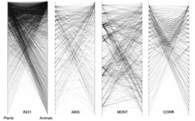

---

+ [Paper](/pdfs/Jordano_etal_2009_CYTED_Cap1.pdf)

---

##### Citation

Jordano, P., D. Vázquez y J. Bascompte. 2009. Redes complejas de interacciones planta-animal. En: Medel, R., Aizen, M., Zamora, R.(eds). Ecología y evolución de las interacciones planta-animal: conceptos y aplicaciones. Editorial Universitaria, Santiago, Chile. Págs.: 17-41.

---

##### Figure

