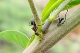

---

+ [Paper](/papers/)

---

##### Citation

Díaz-Castelazo, C., Guimarães Jr., P.R., Jordano, P., Thompson, J.N., Marquis, R.J. and Rico-Gray, V. 2010. Changes of a mutualistic network over time: reanalysis over a 10-year period. Ecology 91: 793-801. Photo: Cecilia Diaz-Castelazo. *Camponotus planatus* on *Crotalaria* extrafloral nectary.

---

##### Notes

2009

---

##### Figure

