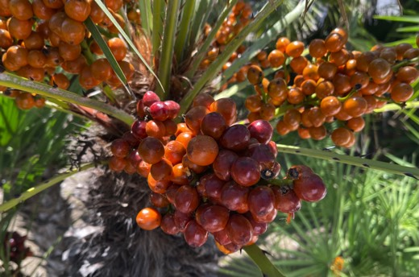

---

+ [Paper](/pdfs/Moreno_etal_2025_JPollinationBiology_Chamaerops.pdf)
+ [DOI: 10.26786/1920-7603(2025](https://doi.org/10.26786/1920-7603(2025)

---

##### Citation

230 Moreno, M., Jacome-Flores, M., Jordano, P., Calvo García, G. and Fedriani, J. 2025. Spatial occupancy patterns of the nursery pollinator *Derelomus chamaeropsis* at its host plant, *Chamaerops humilis* (Arecaceae). - Journal of Pollination Ecology 38: 82–96.

---

##### Figure

