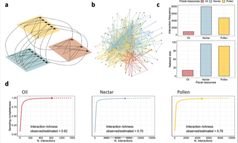

---

##### Citation

Ballarin, C., Amorim, F. and Jordano, P. 2025. Floral resource-mediated multilayer networks: trophic structure and pollinators’ roles. In 2nd. review. November 2025.

---

##### Figure

