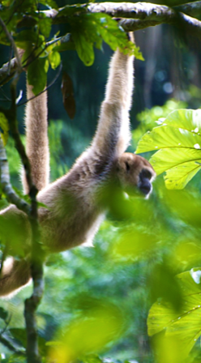

---

##### Citation

Jordano, P. 2026. The ecological interactome: understanding biodiversity through patterns of interactions. In prep. Invited review article for Annual Review of Ecology, Evolution, and Systematics, vol. 57. Scheduled: Nov. 2026.

---

##### Figure

