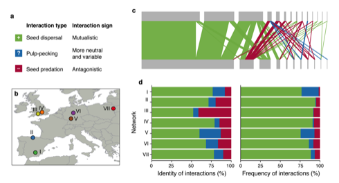

---

##### Citation

 167. Simmons, B., Sutherland, W.J., Dicks, L.V., Albrecht, J., Farwig, N., García, D., Jordano, P. and González-Varo, J.P. 2018. Moving from frugivory to seed dispersal: incorporating the functional outcomes of interactions in plant-frugivore networks. Journal of Animal Ecology 87(4): 995-1007. *In press*.

---

##### Figure

