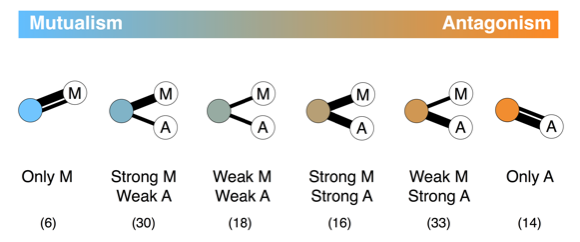

---

##### Citation

 156. Rodríguez-Rodríguez M.C., Jordano P., and Valido A. 2017. Functional consequences of plant-animal interaction motifs along the mutualism-antagonism gradient. Ecology 98: 1266–1276. dos: [10.1002/ecy.1756](http://onlinelibrary.wiley.com/doi/10.1002/ecy.1756/full)

---

##### Figure

