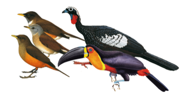

---

+ [DOI: 10.1002/ecy.1818](https://doi.org/10.1002/ecy.1818)

---

##### Citation

 155. Bello C., Galetti M., Montan D., Pizo M., Mariguela T., Culot L., Bufalo F., Labecca F., Pedrosa F., Constantini R., Emer C., Silva W., da Silva F.R., Ovaskainen O., Jordano P. 2016. ATLANTIC-Frugivory: A plant-frugivore interactions dataset for the Atlantic forest. Ecology, 98(6): 1729-1729.

---

##### Figure

