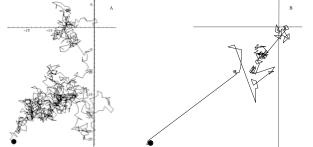

---

+ [DOI: 10.1111/1365-2745.12705](https://doi.org/10.1111/1365-2745.12705)

---

##### Citation

 154. García, C., Klein, E., Jordano, P. 2017. Dispersal processes driving plant movement: challenges for understanding and predicting range shifts in a changing world. Journal of Ecology, 105: 1-5. [doi: 10.1111/1365-2745.12705](http://www.onlinelibrary.wiley.com/doi/10.1111/1365-2745.12705/abstract)

---

##### Figure

