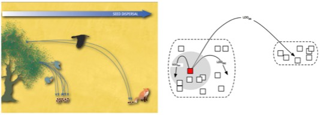

---

+ [DOI: 10.1111/1365-2745.12690](https://doi.org/10.1111/1365-2745.12690)

---

##### Citation

 153. Jordano, P. 2017. What is long-distance dispersal? And a taxonomy of dispersal events. Journal of Ecology, 105: 75-84.

---

##### Notes

2016

---

##### Figure

