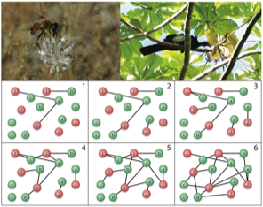

---

+ [DOI: 10.1111/1365-2435.12763](https://doi.org/10.1111/1365-2435.12763)

---

##### Citation

 152. Jordano, P. 2016. Sampling networks of ecological interactions. *Functional Ecology*, 30: 1883–1893.

---

##### Notes

Lay summary is [here](/pdfs/Jordano_2016_FunctEcol_LaySumm.pdf). GitHub repo [here](https://github.com/pedroj/MS_Network-Sampling). [doi: 10.1111/1365-2435.12763](http://onlinelibrary.wiley.com/doi/10.1111/1365-2435.12763/epdf) 

---

##### Figure

