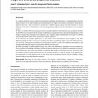
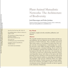
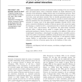
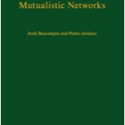

My research focuses on the study of biological diversity (biodiversity) from both ecological and evolutionary perspectives. I am interested in how ecological interactions, e.g. mutualisms, shape complex ecological systems. Interactions, such as those among plants and their seed dispersers and pollinators, are the wireframe of biodiversity, yet we are far from understanding how they evolve and coevolve. My main research tools to address this fascinating theme include field ecology, molecular genetics, and theoretical ecology.

[Summary CV - Pedro Jordano](http://pjordanolab.ebd.csic.es/markdown/ "CV")

[Google Scholar](https://scholar.google.es/citations?user=TrKYqaEAAAAJ&hl=en)

[Research Gate](https://www.researchgate.net/profile/Pedro_Jordano)

[WordPress](https://pedrojordano.wordpress.com/)

[@pedro\_jordano](https://twitter.com/pedro_jordano)

[GitHub](http://github.com/pedroj)

[Papers-Pedro Jordano](/papers/ "Papers_Pedro")

Highlighted papers

- 

  González-Varo, J.P., Arroyo, J.M., and Jordano, P. 2014. Who dispersed the seeds? The use of DNA barcoding in frugivory and seed dispersal studies. Methods in Ecology and Evolution 5: 806–814. doi: 10.1111/2041-210X.12212

- 

  Bascompte, J. and P. Jordano. 2007. The structure of plant-animal mutualistic networks: the architecture of biodiversity. Annual Review of Ecology, Evolution, and Systematics, 38: 567-593.

- 

  Jordano, P., J. Bascompte and J.M. Olesen. 2003. Invariant properties in coevolutionary networks of plant-animal interactions. Ecology Letters 6: 69-81.

- 

  J. Bascompte and P. Jordano. 2013. Mutualistic networks. Monographs in Population Biology, no. Princeton University Press, NJ.  
  [Chapter 1](http://press.princeton.edu/chapters/s10161.pdf).

####
