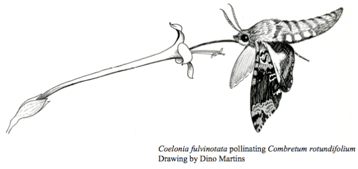

<!-- Generated by fetch-wordpress.py from https://pedrojordano.wordpress.com/2009/05/10/5-annual-harvard-plant-biology-symposium-plants-and-the/ — do not edit by hand. -->

```{=html}
<p></p>
<p> 5th Annual Harvard Plant Biology Symposium Plants and the evolution of cooperation &amp; trading: “Just arrived from the <a href="http://www.pbi.fas.harvard.edu/events.htm" target="_blank">Harvard Univ. symposium</a>,dedicated this year to mutualisms and the evolution of coorperation. Very interesting inter-disciplinary meeting with ecologists, economists, etc. and nicely setup by Naomi Pierce’s lab. My talk was about: ‘Complex networks of interactions and their consequences in diversified plant-animal mutualisms’.”</p>
<p>(Via <a href="http://web.me.com/pedroj/Weblog_de_Pedro/My_Blog/My_Blog.html" target="_blank">Weblog de Pedro</a>.)</p>

```

::: {.wp-original}
Originally published on [my WordPress blog](https://pedrojordano.wordpress.com/2009/05/10/5-annual-harvard-plant-biology-symposium-plants-and-the/).
:::
