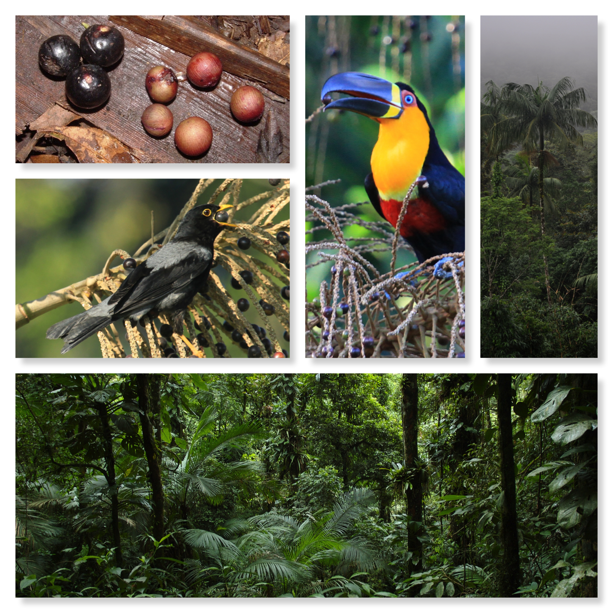

<!-- Generated by fetch-wordpress.py from https://pedrojordano.wordpress.com/2016/01/15/554/ — do not edit by hand. -->

```{=html}
<p class="p1"></p>
<p class="p1"><span class="s1">Frugivory and Seed Dispersal Course (Portuguese/Spanish) – 7-11 March 2016</span></p>
<p class="p1"><span class="s1"><a href="https://t.co/f1r1i89OAq" target="_blank">Registrations</a>: 4 Créditos – 01 a 12/02/2016. </span></p>
<p class="p1"><span class="s1">@UNESP_PG_EcoBio with @mauro_galetti @pedro_jordano.</span></p>
<p class="p1"><span class="s1">Part of the <a href="http://goo.gl/QjLMqW" target="_blank">Programa de Pós-Graduação em Ecologia e Biodiversidade</a>. UNESP, Rio Claro.</span></p>
<p class="p1"><span class="s1">Fotos: Marina Cortes, Guto Balieiro, Lindolfo Souto, Pedro Jordano.</span></p>
<p class="p1">
</p>
```

::: {.wp-original}
Originally published on [my WordPress blog](https://pedrojordano.wordpress.com/2016/01/15/554/).
:::
