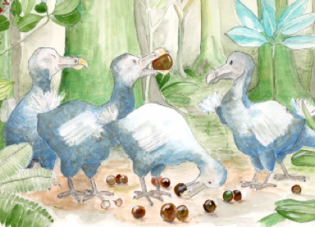

<!-- Generated by fetch-wordpress.py from https://pedrojordano.wordpress.com/2003/12/31/a-symposium-at-univ-aarhus-denmark-networks/ — do not edit by hand. -->

```{=html}
<p></p>
<p><strong>A symposium at Univ. Aarhus, Denmark: networks, interactions, islands</strong></p>
<p>Jens M. Olesen is organizing a symposium “Mother Nature: networks, interactions, islands” for next March 2004 at Aarhus Univ., Dept. Ecology and Genetics. This is a 2-d meeting with exciting talks and discussion, the invited speakers including: Scott Armbruster, Jordi Bascompte, Lars Chittka, Joel Cohen, Yoko Dupont, Bodil Ehlers, Manuel Nogales, Ophelie Ronce, John N. Thompson, Anna Traveset, and Alfredo Valido. I’ll be there too…</p>

```

::: {.wp-original}
Originally published on [my WordPress blog](https://pedrojordano.wordpress.com/2003/12/31/a-symposium-at-univ-aarhus-denmark-networks/).
:::
