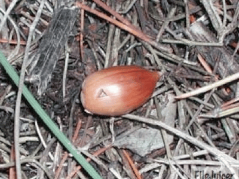

<!-- Generated by fetch-wordpress.py from https://pedrojordano.wordpress.com/2004/04/10/acorns-ive-started-a-collaboration-with-jose/ — do not edit by hand. -->

```{=html}
<p></p>
<p><strong>Acorns</strong></p>
<p>I’ve started a collaboration with José María Gómez (Rocka) to study dispersal patterns of <em>Quercus ilex</em> acorns by jays <em>Garrulus glandarius</em> and mice <em>Apodemus sylvaticus</em>. We’ll be using microsatellite markers and our goal at this moment is just startup and select the markers and test them. For that we’ll be using samples of cached acorns for which Rocka has a good record of the foraging patterns of the jays and mice. The project is a 1-yr study and is integrated in a larger project carried out by Rocka and Geno Schupp.</p>

```

::: {.wp-original}
Originally published on [my WordPress blog](https://pedrojordano.wordpress.com/2004/04/10/acorns-ive-started-a-collaboration-with-jose/).
:::
