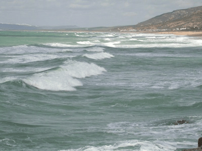

<!-- Generated by fetch-wordpress.py from https://pedrojordano.wordpress.com/2007/09/18/after-summer-well-it-has-been-a-long-time/ — do not edit by hand. -->

```{=html}
<p></p>
<p><strong>After summer</strong></p>
<p>Well, it  has been a long time without news in the blog, but here we are again. 😉 Summer has been quiet; I’ve been at Cadiz coast with Myriam and Perico, with a short visit by Diego. It has been a great time to read, think and write but, again, no painting at all… 😦<br/>
After summer the group has been plenty of news. Geno Schupp and Janis Boettinger arrived in Sevilla for a new sabbatical year. We have plenty of time ahead to start new projects and revisit old ideas, besides enjoying the ‘tapas’ landscape around us.<br/>
We (Jordi, Jens and myself) got the Mercer Award of the Ecological Society of America for the Science paper; and Jordi, Jessica and Miguel Angel went to the meeting in San Jose (California) and enjoyed a splendid ceremony. This award is in recognition for the paper in Science (2006) on interaction asymmetries in mutualistic networks. <br/>
We have a new incorporation of Rocío Rodríguez, to start her PhD project on long-distance seed dispersal in Laurus nobilis and Frangula alnus. In addition, Itziar Sarasa also arrived to the group for a short-term stay until December with an introductory grant from CSIC.<br/>
Additional good news include the new grant-contracts that Arndt Hampe and Kimberly Holbrook obtained for the next 2 years in the group. Arndt is getting back to work on relict oak populations and Kimberly will keep going with the genetic analysis she started with Virola for her PhD, within a comparative project with Prunus.<br/>
Now I’m concentrating on the revision of the megafauna paper with Paulo and Mauro as well as in mss with Alfredo and Martin (fruit colors) and Jordi and Jens (networks); besides there is pending work with Geno on dispersal effectiveness and dispersal limitation that we want to finish. We really have a lot of things going on here, all great fun.</p>

```

::: {.wp-original}
Originally published on [my WordPress blog](https://pedrojordano.wordpress.com/2007/09/18/after-summer-well-it-has-been-a-long-time/).
:::
