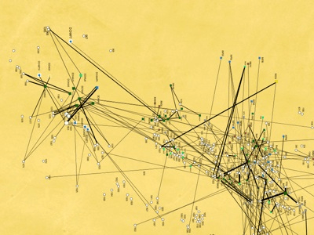

<!-- Generated by fetch-wordpress.py from https://pedrojordano.wordpress.com/2010/12/05/back-from-the-very-interesting-workshop-organized/ — do not edit by hand. -->

```{=html}
<p></p>
<p><strong>The long and short of it</strong></p>
<p>Back from the very interesting workshop organized in Madrid by Juanjo Robledo-Arnuncio. We focussed on long-distance dispersal events (LDD) and their importance to understand the potential responses to climate change. Changes in the environment will force adaptations or long-distance migration and range expansion in plants. Thus a key question is, are the LDD services provided by animal frugivores potentially allowing this environmental tracking. <br/>
We have been advancing a lot in understanding the local, stand-level patterns of dispersal and their consequences. Yet there are numerous conceptual and methodological challenges to understand migration among patches or fragments. LDD events &gt; 500 km will be extremely difficult to assess in a robust way with current techniques, given the tremendous logistic challenge of sampling all the potential available pollen and seed sources. However, LDD events @100 km scale are probably affordable to estimate with a combination of mechanistic models (i.e., relying on high-precision satellite tracking of animal movement combined with physiological models) and genetic tools. Large scale sequencing and cheaper DNA analysis will help to genotype massive amounts of samples and allow the identification of rare immigrants, even when migration rates are low. Some lasting conceptual challenges include the estimation of 2D dispersal kernels that accommodate the complex reality of natural landscapes and the complexities of animal movement, which is quite often markedly directional and anisotropous. </p>
<p>The program of this interesting and thought-provoking workshop is here:</p>
<p><strong>Mini-symposium</strong></p>
<p>Long distance dispersal (LDD): perspectives and new directions</p>
<p>December 2nd, 2010</p>
<p>
Sala Javier Palacios<br/>
Centro de Investigación Forestal (CIFOR)<br/>
Instituto Nacional de Investigación y Tecnología Agraria y Alimentaria (INIA)<br/>
Ctra. de la Coruña km 7,5<br/>
Madrid</p>
<p>8h45 – 9h00. Introduction (Juanjo Robledo-Arnuncio)</p>
<p>9h00 – 10h00 Keynote Speaker: Prof. Ran Nathan (Univ. Jerusalem)<br/>
    A movement ecology approach to study LDD of plants</p>
<p>10h00 – 10h50. Prof. Pedro Jordano (EBD-CSIC)<br/>
    Frugivores, seeds and genes: tracking the LDD events and their consequences</p>
<p>10h50 – 11h20. Coffee break</p>
<p>11h20 – 12h10Dr. Frederic Bartumeus (CEAB-CSIC)<br/>
    LDD: Seed curves, Skewness and Anomalous Diffusion</p>
<p>12h10 – 13h00. Prof. Miguel Ángel de Zavala (Univ. Alcalá)<br/>
    Species distribution models and long-range dispersal</p>
<p>13h00 – 14h30. Lunch at INIA</p>
<p>14h30 – 15h20. Dr. Juanjo Robledo-Arnuncio (CIFOR-INIA)<br/>
    Genetic estimation of LDD among plant populations</p>
<p>15h20 – 17h00. Open Discussion (+ coffee)</p>
<p>17h00. End of mini-symposium</p>

```

::: {.wp-original}
Originally published on [my WordPress blog](https://pedrojordano.wordpress.com/2010/12/05/back-from-the-very-interesting-workshop-organized/).
:::
