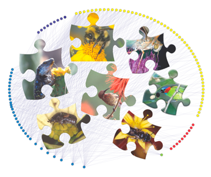

<!-- Generated by fetch-wordpress.py from https://pedrojordano.wordpress.com/2016/04/19/chasing-ecological-interactions/ — do not edit by hand. -->

```{=html}
<p>Ecological interactions are the wireframe of biodiversity. No single species on Earth lives without interacting with other species. Thus, biodiversity is more than just species: interactions among them are the architecture that supports ecosystems. It’s the Web of Life.</p>
<p></p>
<p>Just in the same way we sample individuals of free living species to estimate the diversity of a particular area or ecosystem, we can sample interactions. In this way we can assess the full complexity of ecosystem structure.</p>

```

::: {.wp-original}
Originally published on [my WordPress blog](https://pedrojordano.wordpress.com/2016/04/19/chasing-ecological-interactions/).
:::
