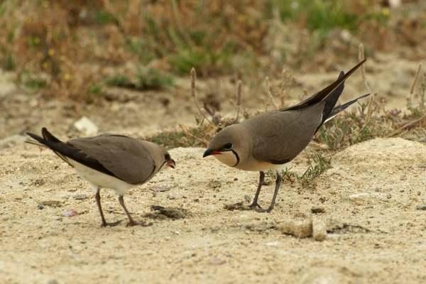
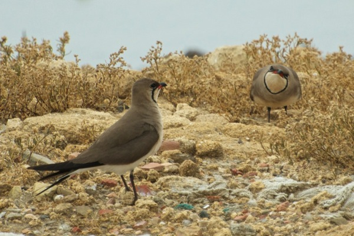
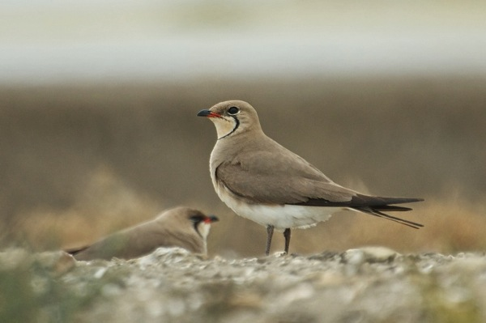
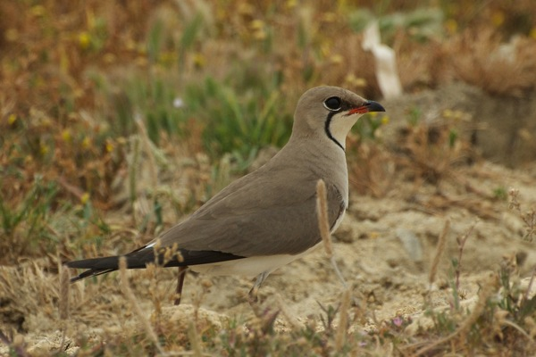

<!-- Generated by fetch-wordpress.py from https://pedrojordano.wordpress.com/2013/05/31/collared-pratincoles/ — do not edit by hand. -->

```{=html}
<p><span style="font-size:large;">These are several shots of Collared pratincoles (<em>Glareola pratincola</em>, Glareolidae) that I took last weekend, at Marismas de Barbate, Cádiz. It was a very nice day, cloudy, but I was lucky to get close to the birds, creeping a lot. These birds are really beautiful. The <a href="http://maps.iucnredlist.org/map.html?id=106003187" target="_blank" title="UICN map">geographic distribution</a> is very patchy in the Western Palaearctic, with few areas in the Iberian Peninsula. </span></p>
<p></p>
<p></p>
<p style="font-size:11px;"></p>
<p></p>

```

::: {.wp-original}
Originally published on [my WordPress blog](https://pedrojordano.wordpress.com/2013/05/31/collared-pratincoles/).
:::
