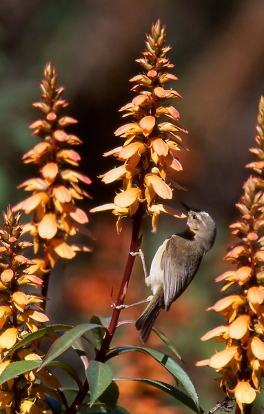
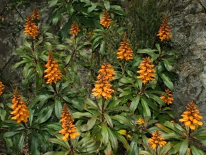
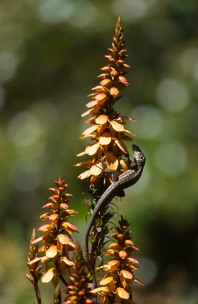

<!-- Generated by fetch-wordpress.py from https://pedrojordano.wordpress.com/2013/02/21/components-of-pollination-effectiveness-and-their-consequences-in-insular-pollinator-assemblages/ — do not edit by hand. -->

```{=html}
<p>Our paper “<a href="http://goo.gl/U0pEV">Quantity and quality components of effectiveness in insular pollinator assemblages</a>” online in Oecologia. Thanks Cande and Alfredo. This is a field study of the pollination of <em>Isoplexis canariensis</em> by birds and lizards in the Canary Islands, a part of Cande Rodríguez PhD project. </p>
<p>Ecologically isolated habitats (e.g., oceanic islands) favor the appearance of small assemblages of pollinators, generally characterized by highly contrasted life modes (e.g., birds, lizards), and opportunistic nectar-feeding behavior. Different life modes should promote a low functional equivalence among pollinators, while opportunistic nectar feeding would lead to reduced and unpredictable pollination effectiveness (PE) compared to more specialized nectarivores. </p>
<p></p>
<p></p>
<p></p>
<p></p>
<p>Dissecting the quantity (QNC) and quality (QLC) components of PE, we studied the opportunistic bird–lizard pollinator assemblage of Isoplexis canariensis from the Canary Islands to experimentally evaluate these potential characteristics. Birds and lizards showed different positions in the PE landscape, highlighting their low functional equivalence. Birds were more efficient than lizards due to higher visitation frequency (QNC). Adult lizards differed from juveniles in effecting a higher production of viable seeds (QLC). The disparate life modes of birds and lizards resulted in ample intra- and inter-specific PE variance. The main sources of PE variance were visitation frequency (both lizards and birds), number of flowers probed (lizards) and proportion of viable seeds resulting from a single visit (birds). </p>
<p>The non-coincident locations of birds and lizards on the PE landscape indicate potential constraints for effectiveness. Variations in pollinator abundance can result in major effectiveness shifts only if QLC is relatively high, while changes in QLC would increase PE substantially only at high QNC. The low functional equivalence of impoverished, highly contrasted pollinator assemblages may be an early diagnostic signal for pollinator extinction potentially driving the collapse of mutualistic services.</p>

```

::: {.wp-original}
Originally published on [my WordPress blog](https://pedrojordano.wordpress.com/2013/02/21/components-of-pollination-effectiveness-and-their-consequences-in-insular-pollinator-assemblages/).
:::
