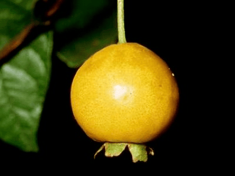

<!-- Generated by fetch-wordpress.py from https://pedrojordano.wordpress.com/2008/02/04/course-on-measurement-of-colors-of-flowers-and/ — do not edit by hand. -->

```{=html}
<p></p>
<p><strong>Course on measurement of colors of flowers and fruits</strong></p>
<p>Together with Alfredo Valido, I gave a short and introductory course on fruit colors and their measurement. We gave that course just prior to the <a href="http://webs.uvigo.es/webecoflor/" target="_blank">ECOFLOR</a> meeting in Valencia, one of the nicest meetings we have here, where a bunch of great people working on pollination biology get together.</p>

```

::: {.wp-original}
Originally published on [my WordPress blog](https://pedrojordano.wordpress.com/2008/02/04/course-on-measurement-of-colors-of-flowers-and/).
:::
