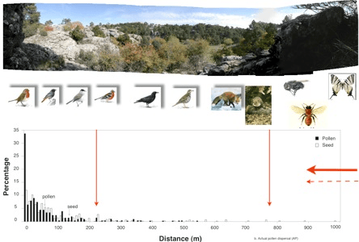

<!-- Generated by fetch-wordpress.py from https://pedrojordano.wordpress.com/2006/12/05/cris-garcia-phd-defense-the-defense-of-cris-phd/ — do not edit by hand. -->

```{=html}
<p></p>
<p><strong>Cris García PhD defense</strong></p>
<p>The defense of Cris’ PhD Thesis took place the 5th Dec at University of Sevilla. We had a great time and everything went well. Members of the committee were Salvador Talavera, Sophie Gerber, Miguel Verdú, José María Gómez, and Gabriel Gutiérrez. The thesis is entitled: “<em>Patterns of animal assisted dispersal and gene flow via pollen and seeds in heterogeneous landscapes</em>”.</p>

```

::: {.wp-original}
Originally published on [my WordPress blog](https://pedrojordano.wordpress.com/2006/12/05/cris-garcia-phd-defense-the-defense-of-cris-phd/).
:::
