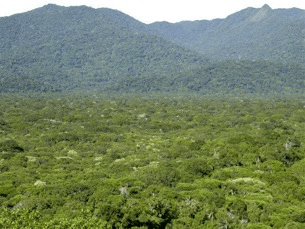

<!-- Generated by fetch-wordpress.py from https://pedrojordano.wordpress.com/2007/03/10/curso-de-frugivoria-em-ilha-de-cardoso-sp/ — do not edit by hand. -->

```{=html}
<p></p>
<p><strong>Curso de Frugivoria em Ilha de Cardoso, SP, Brazil</strong></p>
<p>The 2007 edition of the field course on Frugivory and Seed Dispersal finished. We had an excellent time at Ilha de Cardoso. Not many ripe fruits of palmito juçara (Euterpe edulis) this year but we carried out lots of focal watches at Symplocos trees and other species. As ever, a fantastic experience with a great group students, mainly brazilian this year. We had José María Gómez (Rocka) and Rodolfo Dirzo as invited professors, joining Mauro, Wesley, Marco Aurélio and myself.</p>

```

::: {.wp-original}
Originally published on [my WordPress blog](https://pedrojordano.wordpress.com/2007/03/10/curso-de-frugivoria-em-ilha-de-cardoso-sp/).
:::
