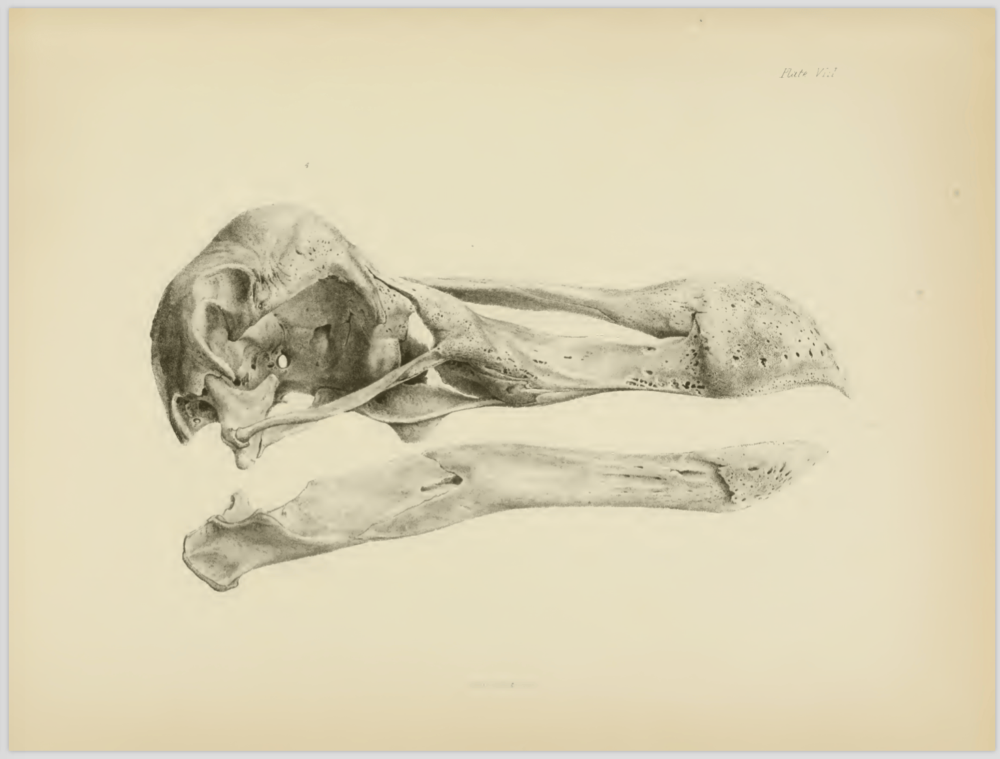
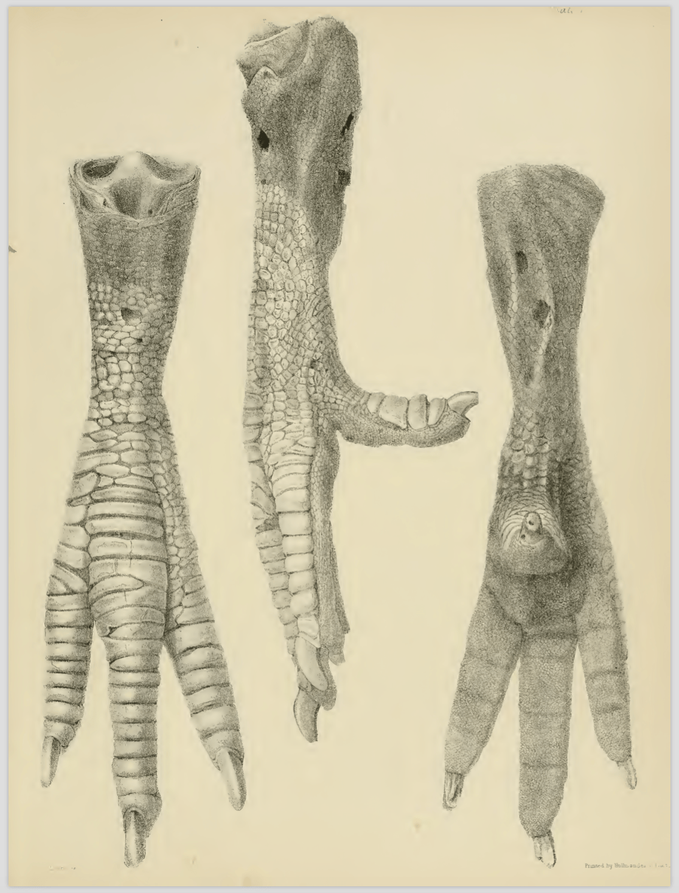

<!-- Generated by fetch-wordpress.py from https://pedrojordano.wordpress.com/2016/12/31/dodo/ — do not edit by hand. -->

```{=html}
<p><figure aria-describedby="caption-attachment-796" class="wp-caption alignnone" data-shortcode="caption" id="attachment_796" style="width: 633px"><figcaption class="wp-caption-text" id="caption-attachment-796">The biota in lowland Mauritius. Julian Hume; <a href="http://www.julianhume.co.uk" rel="nofollow">http://www.julianhume.co.uk</a></figcaption></figure></p>
<p>As stated by David Quammen, “<em>the story of the dodo is obscured by a fog of uncertainties</em>.” By about 1690, if not earlier, it was extinct in its area of endemism, Mauritius. Starting around 1500 with the arrival of Europeans, Mauritius, Rodrigues, and Réunion in the Indian Ocean lost 33 species of birds, including the dodo, 30 species of land snails, and 11 reptiles.</p>
<p><figure aria-describedby="caption-attachment-813" class="wp-caption alignnone" data-shortcode="caption" id="attachment_813" style="width: 3264px"><figcaption class="wp-caption-text" id="caption-attachment-813">Dodo, Raphus cucullatus, Attr. Roelandt Savery, ca. 1626. This oil on canvas is a most famous paintig of the dodo attributed to the Flemish painter, R. Savery. Taking this painting as a guide, Richard Owen placed the bones arranging them over it to get the first scientific description of the fossil remains, published in 1866. Natural History Museum, London, UK.</figcaption></figure></p>
<p> </p>
<p>As other large pigeons, especially on islands, dodos probably relied extensively on fruit food. A famous iconic story relates the extinction of dodos, to the almost co-extinction of a seemingly preferred fruiting tree,<em> Sideroxylon grandifolium</em> (formerly <em>Calvaria</em> <em>major</em>, Sapotaceae, the tambalacoque tree), thought to have relied exclusively on these birds for seed dispersal. The tree is an endemic species. According to historical records, it had once been common in upland Mauritian forests and was often exploited for lumber. According to the original hypothesis of coextinction, set by Temple (1977) based on a traditional belief of Mauritius people: “<em>In response to intense exploitation of its fruits by dodos, </em>S. grandifolium<em> evolved an extremely thick endocarp as a protection for its seeds; seeds surrounded by thin-walled pits would have been destroyed in the dodo’s gizzard. These specialized, thick-walled pits could withstand ingestion by dodos, but the seeds within were unable to germinate without first being abraded and scarified in the gizzard of a dodo.</em>”</p>
<p><div class="tiled-gallery type-square tiled-gallery-unresized" data-carousel-extra='{"blog_id":14689808,"permalink":"https:\/\/pedrojordano.wordpress.com\/2016\/12\/31\/dodo\/","likes_blog_id":14689808}' data-original-width="840" itemscope="" itemtype="http://schema.org/ImageGallery"> <div class="gallery-row" data-original-height="840" data-original-width="840" style="width: 840px; height: 840px;"> <div class="gallery-group" data-original-height="840" data-original-width="840" style="width: 840px; height: 840px;"> <div class="tiled-gallery-item" itemprop="associatedMedia" itemscope="" itemtype="http://schema.org/ImageObject"> <a border="0" href="https://pedrojordano.wordpress.com/2016/12/31/dodo/dodo_mgaletti_berlin/" itemprop="url"> <meta content="836" itemprop="width"/> <meta content="836" itemprop="height"/>  </a> <div class="tiled-gallery-caption" itemprop="caption description"> Dodo, Raphus cucullatus -Museum fur Naturkunde, Berlin, Germany . </div> </div> </div> </div> <div class="gallery-row" data-original-height="280" data-original-width="840" style="width: 840px; height: 280px;"> <div class="gallery-group" data-original-height="280" data-original-width="280" style="width: 280px; height: 280px;"> <div class="tiled-gallery-item" itemprop="associatedMedia" itemscope="" itemtype="http://schema.org/ImageObject"> <a border="0" href="https://pedrojordano.wordpress.com/2016/12/31/dodo/stricklandmelville_1848_platei/" itemprop="url"> <meta content="276" itemprop="width"/> <meta content="276" itemprop="height"/>  </a> <div class="tiled-gallery-caption" itemprop="caption description"> Strickland &amp; Melville (1848) Plate I. View of the dodo head, Oxford University specimen. </div> </div> </div> <div class="gallery-group" data-original-height="280" data-original-width="280" style="width: 280px; height: 280px;"> <div class="tiled-gallery-item" itemprop="associatedMedia" itemscope="" itemtype="http://schema.org/ImageObject"> <a border="0" href="https://pedrojordano.wordpress.com/2016/12/31/dodo/stricklandmelville_1848_plateiii/" itemprop="url"> <meta content="276" itemprop="width"/> <meta content="276" itemprop="height"/>  </a> <div class="tiled-gallery-caption" itemprop="caption description"> Strickland &amp; Melville (1848) Plate III. </div> </div> </div> <div class="gallery-group" data-original-height="280" data-original-width="280" style="width: 280px; height: 280px;"> <div class="tiled-gallery-item" itemprop="associatedMedia" itemscope="" itemtype="http://schema.org/ImageObject"> <a border="0" href="https://pedrojordano.wordpress.com/2016/12/31/dodo/stricklandmelville_1848_platevi/" itemprop="url"> <meta content="276" itemprop="width"/> <meta content="276" itemprop="height"/>  </a> <div class="tiled-gallery-caption" itemprop="caption description"> Strickland &amp; Melville (1848) Plate VI. </div> </div> </div> </div> </div></p>
<p>Dodos were large-bodied birds, averaging- according to the most recent estimates- 10 kg and reaching up to 12 kg (previous estimates reported up to ~21 kg). The beak was very robust, ~5 cm gape width, probably apt to handle and swallow very large fruits as well as other plant material.</p>
<p><figure aria-describedby="caption-attachment-828" class="wp-caption alignnone" data-shortcode="caption" id="attachment_828" style="width: 1760px"><figcaption class="wp-caption-text" id="caption-attachment-828">Seventeenth century depictions of Raphus cucullatus. a, A lean dodo (C. Clusius 1605). b, A fat dodo by A. Van de Venne (1626). Recent mass estimates (Angst et al. 2011) are in better agreement with a than with b, supporting the idea that pictures of extremely fat dodos are exaggerations, not necessarily based on living dodos and often copied from other artists. See Strickland &amp; Melville (1848) for details and additional illustrations.</figcaption></figure></p>
<p>Coextinctions are extremely difficult to demonstrate, especially for interactions involving, e.g., small species (e.g., ectoparasites and hosts) and species involved in generalized interactions (plant-animal mutualisms for pollination and seed dispersal). Yet we have many evidences for functional coextinctions, happening when species become very rare (even extinct) and their ecological roles are lost. Dodos and tambalacoques probably illustrate this. <em>S. grandifolium</em> has persisted on the island likely because of haphazard dispersal by other dispersal agents (e.g., giant skinks and turtles) and rare instances of runoff, etc. Seeds have been found germinating in some cases, yet with very low proportions; while pulp removal was required for germination, it appears that seed scarification does not improve germination significantly. And dodos may had the ability to crack the hard seeds during digestion. Yet there is no proper test available about of all these aspects, as far as I know.</p>
<p><figure aria-describedby="caption-attachment-797" class="wp-caption alignnone" data-shortcode="caption" id="attachment_797" style="width: 2785px"><figcaption class="wp-caption-text" id="caption-attachment-797">A tambalocoque (Sideroxylon grandiflorum, Sapotaceae) seed.</figcaption></figure></p>
<p>The tree still remains in relict stands but juveniles can be found. The dispersal has certainly collapsed, yet with no final effect entailing the extinction of the tree on the island. Probably many local stands of <em>S. grandifolium</em> have disappeared since dodo’s extinction ca. 400 yr ago. Recent analyses of rich fossil plant and animal remains in lowland Mauritius include many <em>S. grandifolium</em> seeds associated with dodo and giant turtle remains. But it seems we are not in front of a tightly coevolved one-to-one instance of pairwise coevolution. Most likely, not simply the dodo extinction contributed to the rarity of tamabalacoques on Mauritius (and several other large-seeded trees): competition with exotic species, were most likely fundamental. Introduced species included Javan deer, goat, pig, crab-eating macaque, and black rat were clear contributors for the dodo’s extinction by destroying the understory vegetation, competing for food sources, and, in the case of the pig, macaque, and black rat, direct predation on eggs and chicks.</p>
<p><figure aria-describedby="caption-attachment-800" class="wp-caption alignnone" data-shortcode="caption" id="attachment_800" style="width: 1510px"><figcaption class="wp-caption-text" id="caption-attachment-800">Fac-simile of Roland Savery’s figure of the Dodo in his picture of the Fall of Adam, in the Royal Gallery at Berlin.</figcaption></figure></p>
<p>Independently of whether the initial reports of coextinction due to loss of the mutualistic dodo were wrong, or biased, or both, the system reflects what happens when ecological interactions are lost: we simply see highly altered systems that remain extremely difficult- or even impossible- to resurrect. And oftentimes the extinction of interactions precedes by a long time the extinction of species, so that what we see is the pervasive effect of the debt of lost interactions.</p>
<ul>
<li>Angst, D., Buffetaut, E. &amp; Abourachid, A. (2011) The end of the fat dodo? A new mass estimate for <em>Raphus cucullatus</em>. Naturwissenschaften, 98, 233–236.</li>
<li>Herhey, D. (2006) The widespread misconception that the tambalacoque or Calvaria tree absolutely required the dodo bird for its seeds to germinate. Plant Science Bulletin, 50, 105–109.</li>
<li>Oudemans, A.C. (1917). Dodo-Studien. Johannes Muller, Amsterdam.</li>
<li>Pimm, S.L. (2002) The dodo went extinct (and other ecological myths). Annals of the Missouri Botanical Garden, 190–198.</li>
<li>Quammen, D. (1996) The Song of the Dodo. Scribner, NY, USA.</li>
<li>Rijsdijk, K.F., Hume, J.P., Louw, P.G.B.D., Meijer, H.J.M., Janoo, A., De Boer, et al. (2016) A review of the dodo and its ecosystem: insights from a vertebrate concentration Lagerstätte in Mauritius. Journal of Vertebrate Paleontology, 35, 3–20.</li>
<li>Strickland, H.E., Melville, A.G. (1848) Dodo and its kindred. History, affinities, and osteology of the dodo, solitaire, and other extinct birds of the islands Mauritius, Rodriguez, and Bourbon. Reeve, Benham and Reeve, London, UK.</li>
<li>Temple, S.A. (1977) Plant-animal mutualism: coevolution with dodo leads to near extinction of plant. Science, 197, 885–886.</li>
<li>Witmer, M.C. &amp; Cheke, A.S. (1991) The dodo and the tambalacoque tree: an obligate mutualism reconsidered. Oikos, 61, 133–137.<br/>
Text: Pedro Jordano. Illustrations and photos, from digitized original books at Biodiversity Heritage Library, and Spanish National Library. Also, photos by M. Galetti and P. Jordano.</li>
</ul>

```

::: {.wp-original}
Originally published on [my WordPress blog](https://pedrojordano.wordpress.com/2016/12/31/dodo/).
:::
