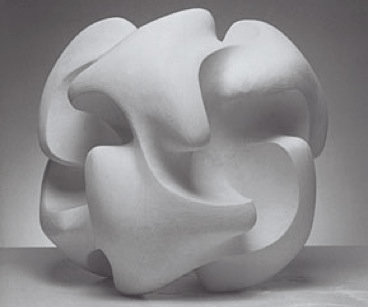

<!-- Generated by fetch-wordpress.py from https://pedrojordano.wordpress.com/2007/11/18/equipo-57-ive-updated-the-photo-gallery-with-a/ — do not edit by hand. -->

```{=html}
<p></p>
<p><strong>Equipo 57</strong></p>
<p>I’ve updated the photo gallery with a special section dedicated to my favorite Equipo 57 sculptures. Equipo 57 was a group of artists based in Córdoba that had a close interaction with my father, Diego Jordano Barea, because of their shared interests in topological geometry and the possibilities of “computable art”. Please visit the web site of a <a href="http://www.cajasanfernando.es/htm/obrasocial/expvir/equipo57/index.htm" target="_blank">recent exhibition</a>.</p>

```

::: {.wp-original}
Originally published on [my WordPress blog](https://pedrojordano.wordpress.com/2007/11/18/equipo-57-ive-updated-the-photo-gallery-with-a/).
:::
