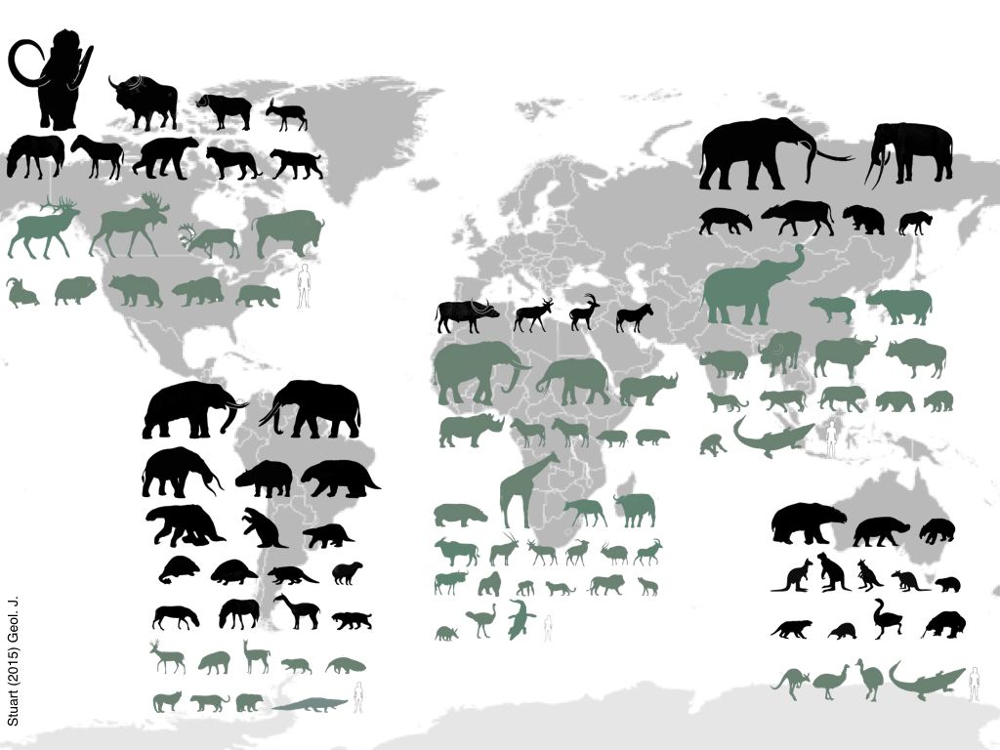

<!-- Generated by fetch-wordpress.py from https://pedrojordano.wordpress.com/2016/12/23/extant-megafauna-frugivores/ — do not edit by hand. -->

```{=html}
<p>The end-Pleistocene mega-mammal extinction (also including other vertebrate groups) likely had a severe effect on present-day megafauna assemblages and impaired important functions associated with ecological interactions involving megafauna taxa. The extant mega-mammal faunas around the world are impoverished versions of the Pleistocene biota on most continents except- perhaps- Africa. In addition, mega-mammals are particularly hard hit by ongoing human-driven disturbances like deforestation, hunting, pollution, and animal trade.</p>
<p><figure aria-describedby="caption-attachment-574" class="wp-caption aligncenter" data-shortcode="caption" id="attachment_574" style="width: 1024px"><figcaption class="wp-caption-text" id="caption-attachment-574">Extinct species (black) and extant species (green) of mammal megafauna in different continents, illustrating the main higher taxa. Stuart, A.J. (2014) Late Quaternary megafaunal extinctions on the continents: a short review. Geological Journal, 50, 338–363.</figcaption></figure></p>
<p>Extant frugivorous mega-mammals are represented in a few orders and families: Carnivora, Artiodactyla, Perissodactyla, Marsupalia, Proboscidea, and Primates. Yet they span a high diversity of body sizes, digestive systems, movement patterns, and foraging modes, presumably defining a wide range of ecological functions for plant dispersal.<br/>
The representation of extant mega-birds is much more restricted- strictly speaking, to the large Ratites (emus, cassowaries, ostrich) most of them consuming fruits to variable extents.</p>
<p><p class="jetpack-slideshow-noscript robots-nocontent">This slideshow requires JavaScript.</p><div class="jetpack-slideshow-window jetpack-slideshow jetpack-slideshow-black" data-autostart="1" data-gallery='[{"src":"https:\/\/pedrojordano.wordpress.com\/wp-content\/uploads\/2016\/12\/537px-sumatran_rhinoceros_way_kambas_2008_crop.jpg?w=537","id":"667","title":"537px-sumatran_rhinoceros_way_kambas_2008_crop","alt":"","caption":"","itemprop":"image"},{"src":"https:\/\/pedrojordano.wordpress.com\/wp-content\/uploads\/2016\/12\/shapeimage_4.png?w=257","id":"668","title":"shapeimage_4","alt":"","caption":"","itemprop":"image"},{"src":"https:\/\/pedrojordano.wordpress.com\/wp-content\/uploads\/2016\/12\/giant-tortoise.jpg?w=840","id":"669","title":"giant-tortoise","alt":"","caption":"","itemprop":"image"},{"src":"https:\/\/pedrojordano.wordpress.com\/wp-content\/uploads\/2016\/12\/elephant6.jpg?w=640","id":"576","title":"elephant6","alt":"","caption":"","itemprop":"image"}]' data-trans="fade" id="gallery-662-1-slideshow" itemscope="" itemtype="https://schema.org/ImageGallery"></div></p>
<p>Then, herps and fish have also a reduced representation, with large iguanas, varanid lizards and giant turtles, on one hand, and a few genera of very large frugivorous fishes.<br/>
The population densities, distribution areas, and even body sizes of these extant megafauna species are being severely reduced by both direct and indirect human influences. This is what we call the anthropocene, and the defaunation events associated to global change drivers such as deforestation. We are just starting to grasp the delayed consequences of this dramatic loss of biodiversity for the persistence of forests worldwide.</p>
<p>Illustration: Pedro Jordano, based on Stuart (2014). Photos: Kulpat Saralamba, Alicia Solana, Néstor Pérez-Méndez, Dennis Hansen.</p>

```

::: {.wp-original}
Originally published on [my WordPress blog](https://pedrojordano.wordpress.com/2016/12/23/extant-megafauna-frugivores/).
:::
