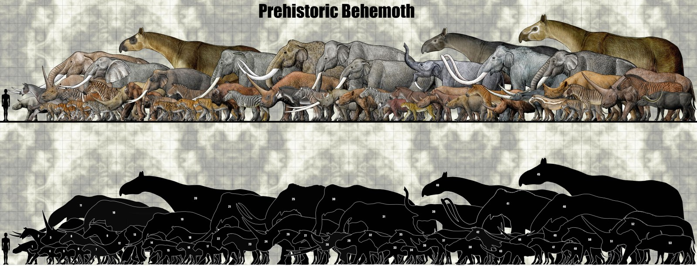

<!-- Generated by fetch-wordpress.py from https://pedrojordano.wordpress.com/2016/12/16/extinct-megafauna-frugivores/ — do not edit by hand. -->

```{=html}

<p class="wp-block-paragraph">The diversity of extinct megafauna frugivores was extremely high in different continents, and a number of them played a central role in the evolution of fruit traits we see today. While the largest South American extant mammal is the tapir (Baird’s, up to 400 kg), consider that 100% of megamammal species (body mass &gt;1000 kg) and about 80% of large mammal species (those over 44 kg) from the Pleistocene South American fauna was extinct ca. 10-12 Kyr BP. At least 37 genera of mammals were eliminated, including most of the megafauna species (i.e., gomphotheres, camelids, ground sloths, glyptodonts, and toxodontids). All megamammals (37 species) and most large mammals (46 species) present during the late Lujanian (latest Pleistocene- earliest Holocene) became extinct in South America (around 30 genera of mammals vanished in North America, 17 in Australia, and 24 in Asia). In contrast, Africa lost 8 of 50 megamammal genera. Africa and Southern Asia are the only continental areas that have terrestrial mammals weighing over 1000 kg today.</p>
<p class="wp-block-paragraph">A number of the extinct Pleistocene megamammals were herbivores, grazers, browsers, and certainly did include fruits in their diet, probably in large amounts, thus potentially acting as seed dispersers for a variety of plants. This fact has been evidenced from coprolites and isotopic analysis of fossil remains, with additional insight from comparative anatomy and morphology. Present-day plant-frugivore interactions still have the signals of these ghosts of evolution.</p>
<p class="wp-block-paragraph"><a href="http://link.springer.com/book/10.1007%2F978-1-4020-8793-6">Haynes, G. (ed.).</a> 2009. American megafaunal extinctions at the end of the Pleistocene. Springer, Berlin.</p>
<p class="wp-block-paragraph"><a href="https://www.amazon.com/Evolution-Nonsensical-Partners-Ecological-Anachronisms/dp/0465005527/ref=sr_1_1?ie=UTF8&amp;qid=1372091400&amp;sr=8-1&amp;keywords=Connie+Barlow" target="_blank">Barlow, C. 2000</a>. The ghosts of evolution: nonsensical fruit, missing partners, and other ecological anachronisms. Basic Books, New York.</p>
<p class="wp-block-paragraph">Illustration: <a href="http://sinammonite.deviantart.com/" target="_blank">Sinammonite</a> @deviantart.com</p>
<p class="wp-block-paragraph">Most of the species shown in this great illustration from Sinammonite (<a href="http://sinammonite.deviantart.com/" rel="nofollow">http://sinammonite.deviantart.com/</a>) were frugivorous (probably with the exception of the large carnivores) and legitimate seed dispersers of their food plants. The figure is high-res; you may wnat to zoom-in and seek the species names by the numbers.</p>
<h2 class="wp-block-heading"><figure></figure></h2>
<p class="wp-block-paragraph">Prehistoric megafauna.<br/>
1. <i>Chilotherium anderssoni</i>: 1.4m<br/>
2. <i>Ancylotherium</i> sp.: 1.8m<br/>
3. <i>Sinotherium lagrelii</i>: 2.6m<br/>
4. <i>Pachycrocuta brevirostris</i>: 1m<br/>
5. <i>Panthera tigris</i>: 0.97m<br/>
6. <i>Homotherium crenatidens</i>: 1.1m<br/>
7. <i>Xenosmilus hodsonaei</i>: 1.1m<br/>
8. “<i>Amerhippus</i>” <i>scotti</i>: 1.5m<br/>
9. <i>Hipparion insperatum</i>: 1.9m<br/>
10. <i>Loxodonta atlantica</i>: 3.5m<br/>
11. <i>Stegodon zdanskyi</i>: 3.9m<br/>
12. <i>Ningxiatherium euryrhinu:</i> 2.2m<br/>
13. <i>Gigantopithecus blacki</i>: 1.8m<br/>
14. <i>Dinocrocuta gigantea</i>: 1.4m<br/>
15. <i>Amphimachairodus palander</i>: 1.1m<br/>
16. <i>Smilodon populator</i>: 1.2m<br/>
17. <i>Panthera atrox</i>: 1.3m<br/>
18. <i>Equus sussenbornensis</i>: 1.8m<br/>
19. <i>Elephas maximus</i>: 2.9m<br/>
20. <i>Dzungariotherium orgosense</i>: 4.5m<br/>
21. <i>Palaeoloxodon antiquus:</i> 4m<br/>
22. <i>Bison priscus:</i> 2.1m<br/>
23. <i>Equus capensis</i>: 1.46m<br/>
24. <i>Elasmotherium chaprovicum</i> 2.8m<br/>
25. <i>Mammuthus trogontherii</i>: 4.5m<br/>
26. <i>Proboscidipparion sinense</i>: 1.8m<br/>
27. <i>Plesippus enormis</i> 1.65m<br/>
28. <i>Ceratotherium cottoni</i>: 1.8m<br/>
29. <i>Diprotodon optatum</i>: 1.9m<br/>
30. <i>Palaeoloxodon recki</i>: 4.5m<br/>
31. <i>Mammut borsoni</i>: 3.5m<br/>
32. <i>Equus koobiforensis</i>: 1.6m<br/>
33. <i>Palorchestes azael:</i> 1.3m<br/>
34. <i>Sivapanthera pleistocaenica</i>: 1m<br/>
35. <i>Equus mosbachensis</i>: 1.65m<br/>
36. <i>Stephanorhinus kirchbergensis</i>: 2m<br/>
37. <i>Palaeotherium giganteum</i>: 1.5m<br/>
38. <i>Zygomaturus trilobus</i>: 1.5m<br/>
39. <i>Deinotherium giganteum</i>: 3.5m<br/>
40. <i>Paraceratherium lepidum</i>: 4.5m<br/>
41. <i>Mammuthus columbi</i>: 4m<br/>
42. “<i>Equus</i>” <i>major</i>: 1.78m<br/>
43. <i>Coelodonta antiquitatis</i>: 1.8m<br/>
44. <i>Bubalus youngi</i>: 1.8m<br/>
45. <i>Dzungariotherium</i>? <i>tienshanense</i>: 5m<br/>
46. <i>Stegodon ganesa</i>: 4m<br/>
47. <i>Sinohippus robustus </i>1.3m<br/>
48. <i>Panthera spelaea</i>: 1.2m<br/>
49. <i>Embolotherium andrewsi</i>: 2.8m<br/>
50. <i>Allohippus sanmeniensis</i>: 1.8m<br/>
51. <i>Elasmotherium caucasicum</i>: 3m<br/>
52. “<i>Equus</i>” <i>giganteus</i>: 2.25m<br/>
53. <i>Syncerus antiquus</i>: 1.65m</p>
<p class="wp-block-paragraph"> </p>
<p class="wp-block-paragraph"></p>

```

::: {.wp-original}
Originally published on [my WordPress blog](https://pedrojordano.wordpress.com/2016/12/16/extinct-megafauna-frugivores/).
:::
