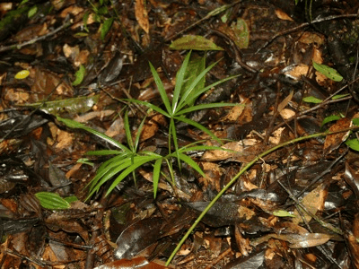

<!-- Generated by fetch-wordpress.py from https://pedrojordano.wordpress.com/2010/03/28/field-course-frugivory-and-seed-dispersal/ — do not edit by hand. -->

```{=html}
<p></p>
<p><strong>Field Course Frugivory and Seed Dispersal, Brazil</strong></p>
<p>I’ve been in Brazil again for the 7th edition of our field course “Frugivoria e Dispersão de Sementes”, co-organized with Mauro Galetti, Marco A. Pizo, and Wesley Silva. This year we run the course in Intervales Park, since Cardoso was not available due to logistic problems. It was a great success, and projects run nicely. Besides, Intervales is an impressive area.</p>

```

::: {.wp-original}
Originally published on [my WordPress blog](https://pedrojordano.wordpress.com/2010/03/28/field-course-frugivory-and-seed-dispersal/).
:::
