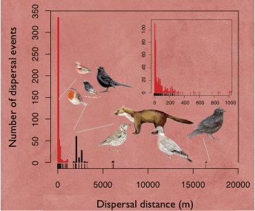

<!-- Generated by fetch-wordpress.py from https://pedrojordano.wordpress.com/2010/12/01/forthcoming-talk-dispersal-near-and-far/ — do not edit by hand. -->

```{=html}
<p></p>
<p><strong>Forthcoming talk – Dispersal near and far</strong></p>
<p>An invited talk, “Frugivores, seeds and genes: tracking the LDD events and their consequences” in the workshop organized by Juanjo Robledo-Arnuncio: Long-distance dispersal: perspectives and new directions. CIFOR-INIA, Madrid.</p>

```

::: {.wp-original}
Originally published on [my WordPress blog](https://pedrojordano.wordpress.com/2010/12/01/forthcoming-talk-dispersal-near-and-far/).
:::
