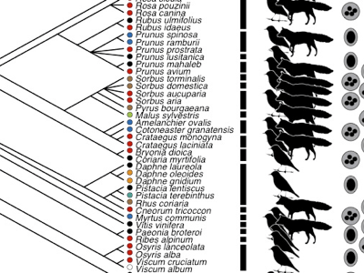

<!-- Generated by fetch-wordpress.py from https://pedrojordano.wordpress.com/2011/03/16/fruit-colors-paper-just-published-in-journal-of/ — do not edit by hand. -->

```{=html}
<p><a href="images/shapeimage_21.png"></a><br/>
 Our study on the evolution of visual displays in plants appeared in the last issue of JEB. We are still working on this subject, now exploring how effective are visual displays (fruit colors) in attracting avian frugivores that might use color cues to build up complex and diverse fruit diets. We have evidence that strongly frugivorous birds might use color cues to guide foraging for fruit combinations that maximize the yield of important nutrients. Rather than consuming fruits at random, frugivorous warblers are quite selective not only on the fruit species they take, but in which combinations they consume the different fruit species.</p>

```

::: {.wp-original}
Originally published on [my WordPress blog](https://pedrojordano.wordpress.com/2011/03/16/fruit-colors-paper-just-published-in-journal-of/).
:::
