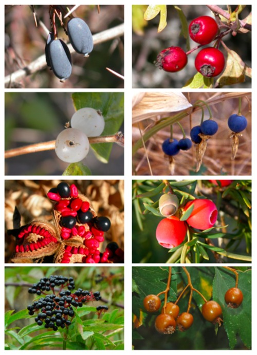

<!-- Generated by fetch-wordpress.py from https://pedrojordano.wordpress.com/2010/12/12/fruits-show-an-immense-diversity-of-colors-and/ — do not edit by hand. -->

```{=html}
<p></p>
<p>Fruits show an immense diversity of colors and displays. However, we are still far from a general theory for the evolution of fruit displays. The main elements of those displays do not only include color itself, but also characteristics of the fruit “design” (ow the fruit is built) like number of seeds, amount of pulp, size, etc., and the nutrients in the pulp (both macro- and micro-nutrients, as well as secondary compounds). All this adds an extraordinary complexity and diversity to the fruit displays. Together with Alfredo Valido and Martin Schaefer I’ve been exploring the evolutionary patterns of fruit traits for the Iberian Peninsula fleshy-fruited flora (ca. 120 species). We studied whether correlated trends between these elements of the display (design, nutrients, color) have been maintained through the phylogenetic diversification of the flora. We found some interesting patterns of covariation between sugar content, lipid content, and color that suggest predictable patterns of fruit evolution in relation to the main types of frugivores feeding on the fruits. Our results suggest that the evolution of fruit displays has been quite constrained by history, yet selection by frugivores might have contributed to marked and predictable covariation among color and nutrient contents. This is an interesting finding to understand the evolution of visual signals in plants, acting to attract diverse suites of animal frugivores that can act as legitimate dispersers of the seeds. Our work is now in press in Journal of Evolutionary Biology.</p>

```

::: {.wp-original}
Originally published on [my WordPress blog](https://pedrojordano.wordpress.com/2010/12/12/fruits-show-an-immense-diversity-of-colors-and/).
:::
