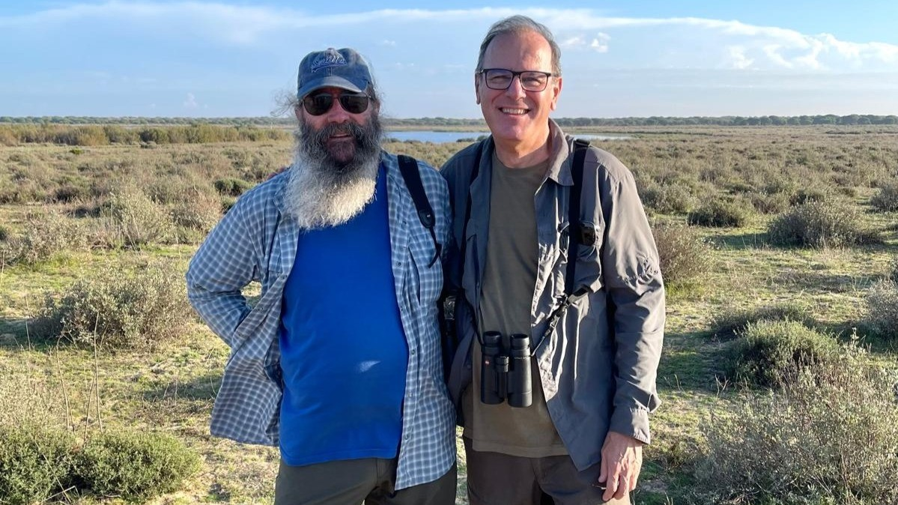

<!-- Generated by fetch-wordpress.py from https://pedrojordano.wordpress.com/2026/07/03/geno/ — do not edit by hand. -->

```{=html}

<h1 class="wp-block-heading has-white-color has-text-color has-link-color has-small-font-size wp-elements-1">In memoriam de Eugene W. Schupp: ciencia, amistad y legado ecológico</h1>
<figure class="wp-block-image size-large"><a href="images/schupp_jordano_donana_19nov2024.jpg"></a></figure>
<p class="wp-block-paragraph"><em>Eugene W. Schupp (izquda.) y Pedro Jordano (dcha.) en el Parque Nacional de Doñana; 19 Noviembre 2024.</em></p>
<hr class="wp-block-separator has-alpha-channel-opacity"/>
<p class="wp-block-paragraph">Con una enorme tristeza y mi cabeza llena de maravillosos recuerdos quiero comunicaros el reciente fallecimiento, el pasado 1 Junio 2026 de mi muy buen amigo y colaborador muy estrecho, Eugene W. Schupp, en Logan, EEUU, a al edad de 74 años. Nuestra amistad y trabajo conjunto se forjaron muy rápidamente a finales de 1987, hace casi 40 años, cuando él realizó una estancia post-doctoral en nuestro grupo de investigación en la Estación Biológica de Doñana – CSIC en Sevilla.</p>
<p class="wp-block-paragraph">Desde ese tiempo no dejamos de trabajar en colaboración, con miles de horas de trabajo de campo juntos y muchísimos días de estudio y análisis de datos y trabajo conjunto, también junto a José María Gómez-Reyes, de EEZA-CSIC. Trabajar con Geno durante muchos años fue tanto un privilegio intelectual como un regalo humano. Nuestro trabajo compartido sobre la efectividad de la dispersión de semillas, desde los primeros estudios empíricos de componentes de cantidad y lluvia de semillas hasta síntesis conceptuales y posteriores extensiones a otras formas de interacción entre especies, fue sostenido por la claridad de pensamiento de Geno y su insistencia en que los conceptos deben permanecer anclados en la realidad biológica. Se preocupaba por obtener los detalles correctos: que los datos coincidiesen con el sistema, que la inferencia coincidiese con la evidencia y que en el campo siguiésemos siendo capaces de responder a la teoría.</p>
<hr class="wp-block-separator aligncenter has-alpha-channel-opacity"/>
<div class="wp-block-image">
<figure class="aligncenter size-large"><a href="images/ewschupp_ups.jpg"></a><figcaption class="wp-element-caption">Geno en Julio 2015 en un área de fynbos al este de Cape Town, Sudáfrica.<br/>Foto: Janis Boettinger.</figcaption></figure>
</div>
<hr/>
<p>Geno es quizás más conocido por su papel central en el desarrollo y refinamiento del concepto de la efectividad de la dispersión de semillas. Su trabajo ayudó a establecer la visión, ahora estándar, de que la contribución ecológica de los animales mutualistas que dispersan semillas depende tanto de la cantidad como de la calidad de la dispersión: cuántas semillas se mueven y dónde terminan y sobreviven para reclutar. Este marco simple pero poderoso ha dado a los ecólogos una forma rigurosa de cuantificar los servicios mutualistas y sigue siendo fundamental en los estudios de las interacciones entre plantas y animales. Con su liderazgo intelectual sutil pero siempre profundo e iluminador, nuestro trabajo conjunto más tarde extendió este marco para acomodar los detalles de cualquier tipo de interacción ecológica. Algunas de estas ideas ya estaban presentes en nuestro primer trabajo sobre la dispersión de semillas de Prunus mahaleb mediada por animales; junto a José María Gómez recordamos largas discusiones sobre los procesos de dispersión de plantas y cómo resolver las peculiaridades y detalles que limitaban una conceptualización adecuada para ser universalmente aplicable. La visión y el pensamiento profundo de Geno fueron fundamentales para evitar las trampas reduccionistas. A pesar de su amor por los finos detalles de la historia natural de sus sistemas de estudio, fue capaz de superar tal complejidad y buscar principios generales y bases conceptuales amplias y transversales. Le gustaba mucho un enfoque científico lento de los problemas: solo disfrutar de un pensamiento profundo sobre alternativas, pasar tiempo arreglando detalles y tener un tratamiento de microcirugía intelectual con cada idea. Todo esto fue el núcleo de muchas de nuestras conversaciones mientras compartíamos algunos buenos vinos y tapas: las ideas, como el buen vino, necesitan tiempo para desarrollarse y mostrar todo su potencial.</p>
<p>Los escritos de Geno, siempre basados en su investigación fundamental sobre el proceso de dispersión de semillas, abordan explícitamente la interacción entre la investigación basada en el lugar (la “ecología del sitio”) y la teoría ecológica, argumentando que el trabajo detallado en paisajes particulares es una base esencial de la ecología general en lugar de una distracción de ella. Este compromiso con el realismo ecológico también dio forma a sus contribuciones a la ciencia de la restauración ecológica. Geno entendió que la restauración depende no solo de principios amplios, sino de los detalles de la disponibilidad de semillas, las vías de dispersión, los micrositios, la herbivoría y el tiempo. Su trabajo en pastizales y arbustos en EEUU occidental contribuyó a una comprensión más mecanicista de por qué las plantas establecen dónde lo hacen y por qué los resultados de la restauración y reforestación dependen tan fuertemente de interacciones sutiles a través del espacio y el tiempo. Las contribuciones posteriores de Geno para comprender los impulsores intrínsecos y extrínsecos de la variación intraespecífica en la dispersión de semillas reflejaron su atención de por vida a cómo los organismos individuales, las poblaciones y los entornos interactúan a lo largo del tiempo, y las profundas consecuencias de tal variabilidad intrínseca. Siempre recordamos sus dos principios favoritos: “Lo único constante [en la vida] es el cambio” y “Todo está conectado”.</p>
<p>Geno era un amante de la vida, del valor de la amistad, de las cosas simples, un enamorado de Triana y Sevilla, gran conocedor del cante flamenco y un experto enólogo. Junto con su mujer, Janis Boettinger, profesora de Edafología en Utah State University e inseparable compañera de viajes y aventuras, juntos reunían una presencia feliz, siempre con una sonrisa, sorprendiéndose constantemente por todo lo que les rodeaba.</p>
<p>Para aquellos que lo conocíamos bien, el carácter de Geno importaba tanto como su categoría académica, o más. Tenía un ingenio discreto, un fuerte sentido de la equidad y una marcada renuencia hacia la autopromoción. Los colegas lo buscaban para una lectura cuidadosa de un manuscrito o un juicio honesto sobre un problema difícil, y él siempre dio ambos libremente. La confianza que inspiraba venía de la consistencia con la que combinó la seriedad intelectual con la amabilidad, la moderación, y una enorme generosidad intelectual. La influencia de Geno perdura en el vocabulario conceptual de la ecología de la dispersión de semillas, en el trabajo de restauración informado por su profundo conocimiento mecanicista del reclutamiento y el establecimiento, y en los muchos estudiantes y colaboradores que seguimos sus estándares de rigor y humildad. También persiste de maneras para mi más transcendentes: en los hábitos cuidadosos de observación de campo, en la generosidad crítica y en el respeto por la historia natural que modeló a lo largo de su vida.</p>
<p>La comunidad ecológica ha perdido a un distinguido científico y a un colega ejemplar, pero su trabajo continúa conformando la manera en que los ecólogos pensamos sobre las plantas, los dispersores y las vías contingentes por las que persisten las especies. Envío desde aquí mis profundas condolencias a la familia, amigos, estudiantes y colegas de Geno en Logan y en todo el mundo. Su vida y obra ejemplificaron una ecología, cuidadosa, conectada y humana, y su actitud vital sigue siendo una inspiración duradera y un tesoro intelectual para todos nosotros.</p>
<hr/>
<p>NOTA: este artículo fue publicado en <a href="https://www.linkedin.com/pulse/memoriam-de-eugene-w-schupp-ciencia-amistad-y-legado-pedro-jordano-wyuvf/?trackingId=i/GJydIQRjWaghCCnBZKmg==">LinkedIn</a> el 7 Jun 2026.</p>


```

::: {.wp-original}
Originally published on [my WordPress blog](https://pedrojordano.wordpress.com/2026/07/03/geno/).
:::
